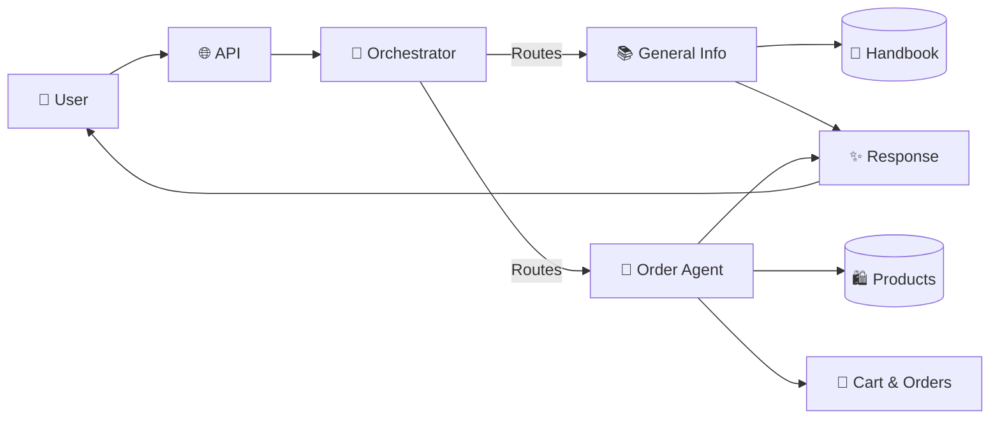

# Agentic Ecommerce Platform - Presentation Slides

## Slide 1: Introduction

### Title: **Agentic Ecommerce Platform**
### Subtitle: Multi-Agent AI System for Intelligent Shopping

**Key Points:**
- 🤖 **AI-Powered Shopping Assistant** with specialized agents
- 🎯 **Intelligent Routing** via LLM-based orchestrator
- 🔍 **Semantic Search** for products and information
- 📊 **Full Observability** with Langfuse
- ⚡ **Production-Ready** with rate limiting, validation, and evaluation

**Visual:**
```
┌─────────────────────────────────────────┐
│  🤖 Multi-Agent System                  │
│  🛒 Ecommerce Platform                  │
│  🎯 Intelligent Routing                 │
│  📊 Observability & Evaluation         │
└─────────────────────────────────────────┘
```

---

## Slide 2: System Architecture (High-Level Flow)

### Title: **System Architecture**

**Visual Flow Diagram:**



**Key Components:**
- **Orchestrator Agent**: LLM-based router (GPT-4o-mini)
- **General Info Agent**: Company policies, FAQs
- **Order Agent**: Product search, cart, checkout
- **Vector Stores**: ChromaDB for semantic search
- **Tools**: Cart management, order processing

**Routing Modes:**
- Single | Sequential | Parallel | Direct

---

## Slide 3: Key Technical Decisions

### Title: **Key Technical Decisions**

**Visual Layout (2 columns):**

**Left Column: Embeddings & Search**
```
🔍 Semantic Search Strategy

✅ OpenAI Embeddings
   • text-embedding-ada-002
   • Cost-effective (~$0.0001/1K tokens)
   • Fast API, outperforms local models
   • No GPU required

✅ Selective Indexing
   • Only searchable properties indexed
   • Excludes volatile data (stock_quantity)
   • Fetched from DB after search
```

**Right Column: Architecture**
```
🏗️ System Architecture

✅ Multi-Agent Design
   • Specialized agents per domain
   • LLM-based intelligent routing
   • Parallel execution support

✅ Non-Blocking I/O
   • All DB ops in thread pool
   • Vector search async
   • Event loop never blocked
```

**Bottom Section:**
```
🎯 Natural Language Understanding
   • Extracts filters from queries
   • "below $100" → max_price filter
   • Category mapping (watches → Electronics)
```

---

## Slide 4: Agent Capabilities & Tools

### Title: **Agent Capabilities**

**Visual: Two Agent Cards Side-by-Side**

**General Info Agent:**
```
📚 General Info Agent
━━━━━━━━━━━━━━━━━━━━━━━━━━━━━━━━━━━━━━━━
Purpose: Company policies, FAQs, shipping info

Tools:
  • retrieve_handbook_info
     └─ Semantic search in handbook

Vector Store:
  • general_handbook (ChromaDB)

Flow:
  Query → Vector Search → Context → LLM → Response
```

**Order Agent:**
```
🛒 Order Agent
━━━━━━━━━━━━━━━━━━━━━━━━━━━━━━━━━━━━━━━━
Purpose: Product search, cart, checkout

Tools (10):
  • search_products (with filters)
  • add_to_cart, edit_item_in_cart
  • remove_from_cart, view_cart
  • get/create/edit_shipping_info
  • get_orders, purchase

Vector Store:
  • products (ChromaDB)

Execution:
  Loop-based (max 6 steps)
  One tool per step
  State checking via tools
```

---

## Slide 5: Observability & Quality

### Title: **Observability & Quality Assurance**

**Visual: Three Sections**

**1. Langfuse Integration:**
```
📊 Full Observability
━━━━━━━━━━━━━━━━━━━━━━━━━━━━━━━━━━━━━━━━
✅ Complete trace lifecycle
✅ Agent spans & tool execution
✅ Performance metrics
✅ Error tracking
```

**2. LLM-as-Judge Evaluation:**
```
⚖️ Quality Evaluation
━━━━━━━━━━━━━━━━━━━━━━━━━━━━━━━━━━━━━━━━
5 Quality Dimensions (1-10 scale):
  • Relevance
  • Accuracy
  • Completeness
  • Clarity
  • Helpfulness

✅ Async evaluation (non-blocking)
✅ Automatic scoring per query
```

**3. Golden Dataset Testing:**
```
🧪 Testing Infrastructure
━━━━━━━━━━━━━━━━━━━━━━━━━━━━━━━━━━━━━━━━
✅ 17 test cases across 9 categories
✅ Automated test runner
✅ Quality score validation
✅ Category breakdown reports
```

**Visual Flow:**
```
Query → Response → Async Evaluation → Langfuse Dashboard
```

---

## Slide 6: Production Features & Results

### Title: **Production-Ready Features**

**Visual: Feature Grid**

```
┌─────────────────────────────────────────────────────────┐
│ Production Features                                      │
├─────────────────────────────────────────────────────────┤
│ 🛡️  Rate Limiting      │ 60 req/min per IP            │
│ 🔒  Token Validation   │ Max 300 tokens (tiktoken)     │
│ 🔄  Connection Retry   │ 3 retries on DB failures     │
│ ⚡  Performance        │ Async I/O, thread pools       │
│ 🎯  Idempotency        │ Duplicate prevention          │
│ 📊  Monitoring         │ Langfuse observability       │
│ 🧪  Testing            │ Golden dataset validation     │
└─────────────────────────────────────────────────────────┘
```

**Key Metrics:**
- ✅ **Non-blocking**: All I/O operations async
- ✅ **Scalable**: Connection pooling, vector store pre-loading
- ✅ **Reliable**: Retry logic, error handling
- ✅ **Observable**: Full tracing and evaluation

**Deployment:**
- 🌐 Live on Render.com
- 📊 Status monitoring via UptimeRobot
- 🔗 API Docs: `/docs`

---

## Slide Design Notes:

### Color Scheme:
- **Primary Blue**: #4A90E2 (User/API layer)
- **Green**: #90EE90 (Orchestration)
- **Orange**: #FFA500 (Agents)
- **Purple**: #9370DB (Data stores)
- **Yellow**: #FFD700 (Evaluation)

### Visual Elements:
- Use icons/emojis for quick recognition
- Keep diagrams simple and clear
- Use boxes/cards for component separation
- Highlight key numbers/metrics
- Use flow arrows to show direction

### Text Guidelines:
- **Titles**: Large, bold (24-32pt)
- **Body**: Concise bullets (14-18pt)
- **Key Points**: Highlighted/bold
- **Numbers**: Large, prominent

### Slide Transitions:
- Keep transitions minimal (fade or none)
- Focus on content clarity
- Use animations sparingly (only for flow diagrams)

---

## Quick Reference for 2-Minute Presentation:

1. **Slide 1 (15s)**: What it is - Multi-agent ecommerce platform
2. **Slide 2 (30s)**: How it works - Architecture flow
3. **Slide 3 (25s)**: Key decisions - Embeddings, architecture, NLU
4. **Slide 4 (30s)**: Agent capabilities - What each agent does
5. **Slide 5 (20s)**: Quality & observability - Langfuse, evaluation
6. **Slide 6 (20s)**: Production features - What makes it production-ready

**Total: ~2 minutes**
